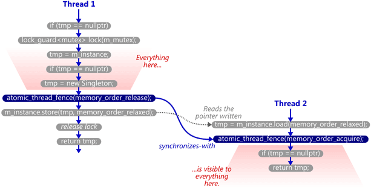

# C++中的Singleton（单例模式）及其实现

 程序设计中某些类经常会有以下需求：在整个程序的生命周期内只需要存在一份实例，其他外部对象只需要和全局的这一份实例进行信息交流。这种情况下，我们就需要用单例的方式去实现这个类。这种设计方式主要有以下几个应用场景：

   + 日志类，一个应用往往只对应一个日至实例；
   + 配置类，应用的配置集中管理，并提供全局访问；
   + 共享资源类，加载资源需要较长时间，使用单例可以避免重复加载资源，并被多个地方共享访问。

但是由于早期的[C++语言虚拟机](https://mortoray.com/2012/06/18/abstract-machines-interpreters-and-compilers/ "Abstract Machines")(Abstract Machine)中并未定义线程、原子操作等概念（至C++11），导致C++语言中的Singleton模式在实现中存在大量的陷阱，所以在下文中会主要介绍单例模式的几种实现方式及其可能存在的缺陷。

## 1. Eager Singleton实现方式
这种实现方式利用**程序首先完成静态对象（包括全局变量和静态变量）的初始化**这一顺序特性实现，代码如下：
```cpp
//Singleton.h
class Singleton
{
public:
    static Singleton& Instance()
    {
        return instance;
    }

private:
    Singleton();
    ~Singleton();
    Singleton(const Singleton&);
    Singleton& operator=(const Singleton&);

private:
    static Singleton instance;
}

// Singleton.cpp
Singleton Singleton::instance;
```
这种实现方式在C++11前是线程非安全的。虽然C++11标准可以保证instance变量的初始化是线程安全的，但是是由于在C++语言中non-local static对象在不同编译单元中的初始化顺序是未定义的，所以如果在其他编译单元中调用Instance方法可能会返回一个未定义的实例，从而程序出现错误，具体讨论内容可以参见[此处](https://isocpp.org/wiki/faq/ctors#static-init-order "static initialization order")。

## 2. Lazy Singleton实现方式
在GoF的[《Design Patterns : Elements of Reusable Object-Oriented Software》](http://www.uml.org.cn/c++/pdf/DesignPatterns.pdf "Design Patterns")中，单例模式被实现为下述形式：
```cpp
// Singleton.h
class Singleton
{
public:
    static Singleton* Instance()
    {
        if (instance_ == NULL)
        {
            instance_ = new Singleton;
        }
        return instance_;
    }

private:
    Singleton();
    ~Singleton();
    Singleton(const Singleton&);
    Singleton& operator=(const Singleton&);

private:
    static Singleton* instance_;
}

//Singleton.cpp
Singleton* Singleton::instance_ = NULL;
```
Lazy Singleton的实现方式中将默认构造函数、复制构造函数、赋值操作符声明为`private`属性，禁止外部对象自己构造新的Singleton实例。但是，该实现方式不是线程安全的，考虑如下场景：

  * 线程A进入`Instance`方法，执行代码至if判断语句，此时线程A因为外部原因被suspend
  * 线程B进入`Instance`方法，由于线程A并未对`instance_`变量作出修改，所以线程B中判断`instance_ == NULL`，进而为其分配内存
  * 一段时间后，线程A被唤起，由于已经判断`instance_ == NULL`，此时A线程*再次*为instance_分配内存
  * 此时，内存中存在两个`instance_`变量，违背了单例模式的初衷。

那么，可不可以加把锁控制下进入判断语句线程的顺序呢？答案是肯定的，但是代价太过高昂，考虑以下代码片段：
```cpp
// Singleton.cpp
Singleton* Single::Instance() {
    Lock lock; // acquire lock (params omitted for simplicity)
    if (instance_ == NULL) {
        instance_ = new Singleton;
    }
    return instance_;
}
```
在上述代码中，每一次访问`instance_`变量都会申请一次锁，但是实际上我们只需要在初始化`instance_`变量时保证互斥访问就可以了。在程序运行过程中，如果`Instance`方法被调用了`n`次，那么，我们只需要锁住第一次调用就可以了，剩下的`n - 1`次都是不必要的浪费。

## 3. The Double-Checked Locking Pattern
### 3.1 简易版DCLP
为了解决Lazy Singleton实现方式中对资源不必要的浪费问题，人们又提出了双重验证的实现方式，DCLP的核心是基于以下观察：**大多数的调用中instance_变量都是非空变量**。因此，DCLP的工作流程如下：

  1. 判断instance_变量是否为非空变量
  2. 如果instance_为空，获取锁
  3. 判断instance_变量是否为非空变量
  4. 如果instance_为空，创建、构造instance_变量

以下代码为双重检测的代码实现：
```cpp
//Singleton.cpp
Singleton* Singleton::Instance() {
    if (instance_ == NULL) {
        Lock lock;
        if (instance_ == NULL) {
            instance_ = new Singleton;
        }
    }

    return instance_;
}
```
乍看之下，似乎完美的解决了所有问题，但是还记得上篇博客对new/delete操作符的[讨论](http://blog.allensong.org/cpp_new_delete/ "new/delete")吗？下述语句`instance_ = new Singleton`可以分解为以下三个步骤：

  1. 调用`operator new`函数分配内存，用于装载Singleton对象
  2. 在已分配的内存上调用Singleton构造函数，初始化对象
  3. 将instance_指向这块内存
同时，编译器并没有被约束一定要按照1 -> 2 -> 3的步骤去生成机器指令，在某些时候编译器是可以交换2、3两个步骤的。请看以下*伪代码*片段：

```cpp
Singleton* Singleton::Instance() {
    if (instance_ == NULL) {
        Lock lock;
        if (instance_ == NULL) {
            instance_ =                           // 步骤3
                operator new(sizeof(Singleton));  // 步骤1
            new (instance_) Singleton;            // 步骤2
        }
    }

    return instance_;
}
```
并考虑如下执行步骤：

  * 线程A执行`Instance`方法，一路畅通至步骤1处，此时因为某些外部原因，线程A被挂起。此时`instance_`变量非空，但是此处的内容为无效内容即**尚未构造`Singleton`类的实例**
  * 线程B执行`Instance`方法，判断`instance_`变量为非空，直接返回`instance_`变量。调用者通过解引用访问Singleton类，程序此时Crash。

[Scott Meyers](http://scottmeyers.blogspot.jp/ "Blog of Meyers")和Andrei Alexandrescu的这篇[文章](http://www.aristeia.com/Papers/DDJ_Jul_Aug_2004_revised.pdf "DDJ_Jul_Aug_2004_revised.pdf")(Page 6~7)中详述了这一实现方式所存在的问题。

### 3.2 增强版DCLP - 使用`volatile`关键字
>Every access (read or write operation, member function call, etc.) on the volatile object is treated as a >visible side-effect for the purposes of optimiaztion (that is, **within a single thread of execution**, >volatile accesses **cannot be optimized out or reordered** with another visible side effect that is >sequenced-before or sequenced-after the volatile access.)

根据之前的分析，似乎我们在声明`instance_`变量时加上`volatile`关键字就可以解决问题了，实现如下：
```cpp
//Singleton.h
class Singleton
{
public:
    static volatile Singleton* volatile Instance();

private:
    static volatile Singleton* volatile instance_;
};

//Singleton.cpp
volatile Singleton* volatile Singleton::instance_ = NULL;

volatile Singleton* volatile Single::Instance() {
    if (instance_ == NULL) {
        Lock lock;
        if (instance_ == NULL) {
            volatile Singleton* volatile temp =
                new volatile Singleton;
            instance_ = temp;
        }
    }

    return instance_;
}
```
很可惜，依然无法解决多线程的问题。请注意引文中所描述的场景是**single thread**，这意味着标准并不约束编译器做多线程之间的指令重排。所以，从语言层面上说，在**C++11**前是无法正确实现多线程场景下的单例模式，更不用提**多核CPU**（Cache的一致性问题）的场景了。

### 3.3 可以正确工作的DCLP
Scott Meyers在论文的最后陈述了一种正确的单例模式的实现方式，伪代码如下：
```cpp
Singleton* Singleton::Instance() {
    Singleton* temp = instance_;
    // Insert memory barrier
    if (temp == NULL) {
        Lock lock;
        temp = instance_;
        if (temp == NULL) {
            temp = new Singleton;
            // Insert memory barrier
            instance_ = temp;
        }
    }
    return instance_;
}
```
其中，memory barrier被定义为如下:

>A memory barrier, also known as a membar, memory fence or fence instruction, is a type of barrier instruction that causes a central processing unit (CPU) or compiler to enforce **an ordering constraint on memory operations** issued before and after the barrier instruction. This typically means that **operations issued prior to the barrier are guaranteed to be performed before operations issued after the barrier**.

在DCLP中，我们使用屏障指令保证：在初始化Singleton实例完成后`instance_`变量为非空。伪代码中，使用了注释来标注屏障指令，原因是不同的平台，屏障指令有所不同。

## 4. C++11标准下单例模式的实现方式
### 4.1 基于DCLP的实现方式
C++11标准中定义了线程、原子操作以及新的内存模型，通过这些新增的标准可以正确的实现单例模式：
```cpp
std::atomic<Singleton*> Singleton::instance_;
std::mutex Singleton::m_mutex;

Singleton* Singleton::Instance() {
    Singleton* temp = instance_.load(std::memory_order_relaxed);
    std::atomic_thread_fence(std::memory_order_acquire);
    if (temp == nullptr) {
        std::lock_guard<std::mutex> lock(m_mutex);
        temp = instance_.load(std::memory_order_relaxed);
        if (temp == nullptr) {
            temp = new Singleton;
            std::atomic_thread_fence(std::memory_order_release);
            instance_.store(temp, std::memory_order_relaxed);
        }
    }

    return temp;
}
```
在多线程/多核运行时，运行的过程如下图所示(盗自[Preshing的博客](http://preshing.com/20130930/double-checked-locking-is-fixed-in-cpp11/ "double-checked-locking-is-fixed-in-cpp11"))：


Preshing在这篇文章中详细说明了C++11中如何正确实现单例模式的方法，此处不再详细展开。

### 4.2 基于静态对象初始化的实现方式
看到4.1节描述的单例模式时，我的心情是这样的：←_←||，整整花了一周时间去理解std::memory_order、看Preshing的博客，太复杂了!那有没有简单、方便的实现方式呢？答案是肯定的，C++11中可以实现为如下代码：
```cpp
Singleton& Singleton::Instance() {
    static Singleton instance_;
    return instance_;
}
```
可能有同学会疑问，这不就是Eager Singleton实现方式中将instance_变量移动到了函数内部吗？没错，虽然对于代码来说这只是一小步；但是对于我们程序员来说，这却是一大步。。。且看C++标准是如何表述static local变量的：

>Variables declared at **block scope** with the specifier static have static storage duration **but are initialized the first time control passes through their declaration**

从这点上说，instance_变量只会在第一次调用时初始化，不会出现Eager Singleton实现方式中出现的初始化顺序不定的问题。再来看C++11标准另一个描述：

>If multiple threads attempt to initialize the same static local variable concurrently, **the initialization occurs exactly once** (similar behavior can be obtained for arbitrary functions with std::call_once).
Note: usual implementations of this feature use variants of the double-checked locking pattern, which reduces runtime overhead for already-initialized local statics to a single non-atomic boolean comparison.

从引文中可以看出，在多线程同时访问静态局部变量时，C++11标准保证了该初始化只能被执行一次。
所以，到此，C++中的单例模式终于在C++11标准中得到了完美的解决~

## 5. 总结
C++中的单例模式实现方法有很多种，平常推荐使用4.2节描述的实现方式，简单、明了。当然，如果对C++11的内存模型很了解的话，可以使用内存屏障指令限制编译器的指令重排，而这些都需要在实践中不断的摸索、使用、总结才会愈加熟练。

## 6. 参考文献
1. [单例模式(Singleton)及其C++实现](http://www.zkt.name/dan-li-mo-shi-singleton-ji-c-shi-xian/ "单例模式(Singleton)及其C++实现")
2. [Double-Checked Locking is Fixed In C++11](http://preshing.com/20130930/double-checked-locking-is-fixed-in-cpp11/ "Double-Checked Locking is Fixed In C++11")
3. [如何正确地写出单例模式](http://wuchong.me/blog/2014/08/28/how-to-correctly-write-singleton-pattern/ "如何正确地写出单例模式")
4. [static storage duration](http://en.cppreference.com/w/cpp/language/storage_duration "static storage duration")
5. [DDJ_Jul_Aug_2004_revised](http://www.aristeia.com/Papers/DDJ_Jul_Aug_2004_revised.pdf "DDJ_Jul_Aug_2004_revised.pdf")
6. [Abstract Machines, Interpreters and Compilers](https://mortoray.com/2012/06/18/abstract-machines-interpreters-and-compilers/ "Abstract Machine")
7. [std::memory_order](http://en.cppreference.com/w/cpp/atomic/memory_order "memory order")
8. [Acquire and Release Fences](http://preshing.com/20130922/acquire-and-release-fences/ "acquire-release-semantic")
