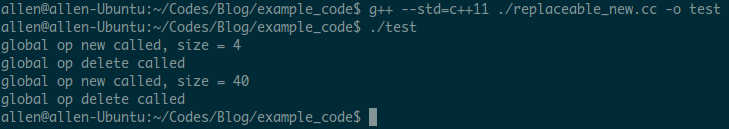
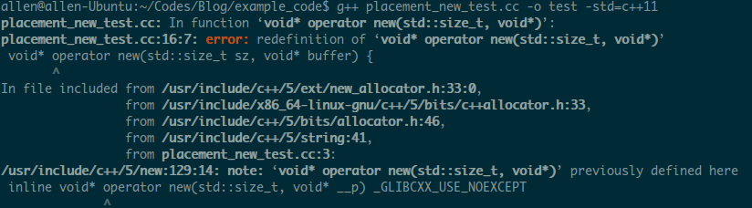
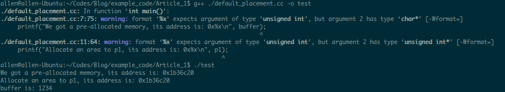
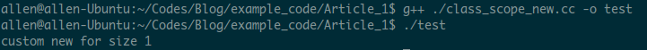
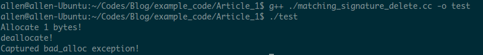

# C++中的new和delete

最近阅读了[cppreference.com](http://en.cppreference.com/w/ "cppreference.com")上的[new expression](http://en.
cppreference.com/w/cpp/language/new "new expression")和[operator new](http://en.cppreference.com/w/cpp/memory/
/operator_new)的定义，收获颇丰，所以特此记录下来，一是形成笔记时会再一次梳理内容，可以检验自己是否真正掌握了文章的意思；二是供以后查阅使用。<br />
全文按照如下章节组织(本文只讨论单对象内存的申请和释放，数组同理)：<br />
　　[1. new expression和operator new](#section_1) <br />
　　　　[1.1. new expression](#sub_section_1_1) <br />
　　　　[1.2. operator new](#sub_section_1_2) <br />
　　　　　　[1.2.1. replaceable allocation functions](#sub_section_1_2_1) <br />
　　　　　　[1.2.2. placement allocation functions](#sub_section_1_2_2) <br />
　　　　　　[1.2.3. class-specific allocation functions](#sub_section_1_2_3) <br />
　　[2. delete expression和operator delete](#section_2) <br />
　　　　[2.1. delete expression](#sub_section_2_1) <br />
　　　　[2.2. operator delete](#sub_section_2_2) <br />
　　[3. 结语](#section_3) <br />

## <span id="section_1"> 1. new expression和operator new </span>
### <span id="sub_section_1_1"> 1.1 new expression </span>
new expression其实就是我们在申请内存时使用的表达式，其定义如下：

```C++
/* placement_params 将会在operator new函数章节详细介绍 */
1. ::(optional) new (placement_params)(optional) ( type ) initializer(optional)
2. ::(optional) new (placement_params)(optional) type initializer(optional)
```
两种定义的区别在于`type`是否包含小括号。通常情况下，我们使用第二种方式申请内存，例如：

```C++
1. int *a = new int(5);
2. char *b = new char;
3. auto *p = new auto('c');  // initializer is required
```
注意第三个例子中的`initializer`是**必须**的，C++语言需要它去推导出`p`的类型。
第一种定义一般用于申请比较复杂的类型时，需要用小括号描述一个完整的类型定义，例如：

```C++
1. new int(*[10]) ();		//wrong, parsed as (new int) (*[10]) ()
2. new (int (*[10]) ());	//correct, allocates an array of ten pointers to function
```
从整体上看，执行完new expression后，我们便获得了一块内存并且可以对这块内存进行一系列的操作。但是，在执行new expression时，C++语言做了哪些动作呢？下面看下C++语言是如何解释new expression的：
> The new expression attempts to **allocate storage** and then attempts to **construct and initialize** either a single unnamed object, or an unnamed array of objects in the allocated storage. The new-expression returns a prvalue pointer to the constructed object or, if an array of objects was constructed, a pointer to the initial element of the array

从上述解释中，我们可以看出new expression包括了两项动作：<br/>
　　i.  分配内存<br/>
　　ii. 构造并初始化对象<br/>
其中，分配内存的动作由`operator new`函数完成，构造并初始化对象则由构造函数完成。那么，我们可以得出这样的结论：new expression其实是通过调用`operator new`函数和相应类型的构造函数完成动作的，更形象的可以描述为：

```C++
new expression(T) {		// 只是用于形象的描述
    T* t = operator new(sizeof(T));
    t->consturctor_of_T();
}
```

### <span id="sub_section_1_2"> 1.2 operator new </span>
<span id="operator_new_define"> 首先，描述下`operator new`函数是如何定义的：</span>

```C++
// replaceable allocation functions
1. void* operator new (std::size_t count);
2. void* operator new (std::size_t count, const std::nothrow_t& tag);

// placement allocation functions
3. void* operator new (std::size_t count, void* ptr);
4. void* operator new(std::size_t count, user_defined_args...);

// class-specific allocation functions
5. void* T::operator new(std::size_t count);
6. void* T::operator new(std::size_t count, user_defined_args...);
```
下面按照上述三种类别分别介绍`operator new`函数：

#### <span id="sub_section_1_2_1"> 1.2.1 Replaceable allocation functions </span>
顾名思义，这类`operator new`函数是可被替换的，当我们提供了一个与定义1或者2相同签名的`operator new`函数时，默认的实现就会被替换为用户自定义的版本。**注意**，当我们定义了多个相同签名的`operator new`函数或者是`operator new`函数被指定为`inline`时，编译器的行为是未知的。以下为测试代码：
```C++
// 代码摘自cppreference
#include <cstdio>
#include <cstdlib>

//replacement of a minimal set of functions:
void* operator new(std::size_t sz) {
    std::printf("global op new called, size = %zu\n", sz);
    return std::malloc(sz);
}

void operator delete(void* ptr) noexcept {
    std::puts("global op delete called");
    std::free(ptr);
}

int main() {
    int *p1 = new int;
    delete p1;

    int* p2 = new int[10];
    delete[] p2;
}
```
输出结果如下：



#### <span id="sub_section_1_2_2">1.2.2 Placement allocation functions </span>
placement syntax[(定义3,4)](#operator_new_define)主要有以下几个应用场景： 

- default placement
- preventing exceptions
- custom allocators
- debugging

下面按照列出的顺序，分别介绍各应用场景：
##### 1.2.2.1 Default placement(Pointer placement)
[定义3](#operator_new_define)即为default placement的定义, 这些定义存在于C++的标准库中，不能够被替换或者是重载。例如：
```C++
// 错误，不能定义此函数
void* operator new(std::size_t sz, void* buffer) {
    return buffer;
}

int main() {
    return 0;
}
```
将会输出如下错误：



default placement主要用于不需要通过`operator new`获取内存(可能已经拥有了一块预先分配好的内存)，但是却需要在此块内存上构造对象的情形，例如：

- 特定硬件地址上存在的对象
- 多进程/CPU之间的共享内存

以下为default placement的测试程序：
```C++
#include <cstdio>
#include <cstdlib>
#include <iostream>

int main() {
    char *buffer = (char*) calloc(sizeof(char), 256);
    printf("We got a pre-allocated memory, its address is: 0x%x\n", buffer);

    unsigned int *p1 = new(buffer) unsigned int;
    *p1 = 0x34333231;
    printf("Allocate an area to p1, its address is: 0x%x\n", p1);

    std::cout << "buffer is: " << buffer << std::endl;
    free(buffer)

    return 0;
}
```
输出结果如下：


##### 1.2.2.2 Preventing exceptions
C++标准委员会规定，`operator new`(non-placement)函数在出现错误时，例如内存耗尽,需要抛出std::bad_alloc(或是继承自std::bad_alloc的子类)异常，如果不希望处理这些异常，那么我们可以调用`operator new(std::size_t sz, const std::nothrow_t&)`[(定义4)](#operator_new_define)，例如：
```C++
// 代码摘自Wikipedia - Placement syntax
#include <new>

struct T {};

int main() {
    T *p = new (std::nothrow)T;
    if (p) {
        // The storage has been allocated and the constructor called.
        delete p;
    } else 
        ;   // An error has occured. No storage has been allocated and no object constructed.

    return 0;
}
```
**注意**，必须包含 <new\> 头文件，该文件中定义了类型为`std::nothrow_t`的变量`std::nothrow`
##### 1.2.2.3 Custom allocators
Custom allocators多用于用户希望自定义管理内存的申请和释放的情形，例如：
```C++
// 代码摘自Wikipedia - Placement syntax
#include <cstdlib>
class A {
public:
    void* allocate(std::size_t);
    void deallocate(void *);
};

void* operator new(std::size_t sz, A& arena) {
    return arena.allocate(size);
}

void operator delete(void* p, A& arena) {
    arena.deallocate(p);
}

A first_arena, second_arena;
T* p1 = new(first_arena) T;
T* p2 = new(second_arena) T;

// 不要调用delete语句
// delete p1;
// delete p2;
```
**注意**，当程序结束时不要使用delete语句释放p1,p2申请的内存，这是因为**C++中没有placement delete expression(请区分placement *function*和placement *expression*)**,想要正确
释放p1和p2的内存，可以通过如下方式：
```C++
operator delete(p1, first_arena);
operator delete(p2, second_arena);
```
或者是定义如下函数并调用：
```C++
void destroy(T *p, A& arena) {
    p->~T();
    arena.deallocate(p);
}

destroy(p1, first_arena);
destroy(p2, second_arena);
```
##### 1.2.2.4 Debugging
通过向`operator new`函数传递行数、文件名等信息，我们可以在内存分配失败时获取到失败处的信息，例如：
```C++
// 代码摘自Wikipedia - Placement syntax
#if defined(DEBUG_NEW)
void* operator new(std::size_t size, const char* file, int line);
void* operator new[](std::size_t size, const char* file, int line);
void* operator delete(void *p, const char* file, int line);
void* operator delete[](void *p, const char* file, int line);
#define New new(__FILE__, __LINE__)
#else
#define New new
#endif
```

#### 1.2.3 <span id="sub_section_1_2_3"> Class-specific allocation functions </span>
new expression在查找合适的`operator new`函数时总是**先从类作用域**开始查找，当在类作用域内未找到相应的`operator new`函数时才会使用全局定义的`operator new`函数。所以，如果类内定义了`operator new`函数则会覆盖全局作用域内的`operator new`函数。例如,
```C++
// class-specific allocation functions
class A {
public:
    static void* operator new(std::size_t sz) {
        std::cout << "custom new for size " << sz << std::endl;
        return ::operator new(sz);
    }
};

int main() {
    A* p1 = new A;
    delete p1;
}
```
输出结果如下：



**注意**, 不论是否使用`static`关键字，`operator new`函数总是静态成员函数。

### 2. <span id="section_2"> delete expression和operator delete </span>
#### 2.1 delete expression
delete expression可以描述为[new expression](#section_1)的反向操作，唯一不同的是**delete expression没有placement delete expression**，其语法如下：
```C++
// 没有placement_params
::(optional) delete expression
```
需要注意的是，*expression*必须是一个指向具有[**完整类型**](http://en.cppreference.com/w/cpp/language/type)或是类型可做[**隐式转换**](http://en.cppreference.com/w/cpp/language/implicit_conversion)的对象的指针，指针的值可以是以下三种：

- nullptr
- new expression分配的指向非数组类型对象的指针
- new expression分配的指向继承类对象的基类指针

同样，看下delete expression的定义：
> *Destructs* object(s) previously allocated by the [new expression](#section_1) and *releases* obtained memory area

**注意**，delete expression执行的动作顺序与new expression是相反的，形式化的描述如下：

```C++
delete expression(T) {
    T->destructor_of_T();   // 析构
    operator delete(T);     // 释放内存
}
```

#### <span id="sub_section_2_2"> 2.2 operator delete </span>
同样，描述下`operator delete`的语法：
```C++
// replaceable deallocation functions
1. void operator delete (void* ptr);
2. void operator delete (void* ptr, const std::nothrow_t& tag);
3. void operator delete (void* ptr, std::size_t sz);                (since C++14)

// placement deallocation functions
4. void operator delete (void* ptr, void* place);
5. void operator delete (void*ptr, user-defined-args...);

// class-specific deallocation functions
6. void T::operator delete (void* ptr);
7. void T::operator delete (void* ptr, std::size_t sz);
8. void T::operator delete (void* ptr, user-defined-args);
```
以调用者的不同，将上述8种定义分为两种：

- 调用者是delete expression：  
定义1,3,6,7的调用者是delete expression，因此并不存在placement delete expression，具体的原因请参考[Stroustrup的回答](http://www.stroustrup.com/bs_faq2.html#placement-delete "Is there a placement delete")。所以使用placement new expression申请的内存，使用完毕后一定要确保正确释放。
- 调用者是new expression：  
定义2,4,5,8在new expression调用构造函数出现异常时被调用，例如：
```C++
#include <iostream>
#include <new>
#include <exception>

struct X {
    X() {
        throw std::bad_alloc();
    }

    static void* operator new(std::size_t sz, const std::nothrow_t& tag) {
        std::cout << "Allocate " << sz << " bytes!" << std::endl;
        return ::operator new(sz);
    }

    static void operator delete(void *ptr, const std::nothrow_t& tag) {
        std::cout << "deallocate!" << std::endl;
        return ::operator delete(ptr);
    }
};

int main() {
    try {
        X *x = new(std::nothrow) X;
    } catch (const std::bad_alloc& e) {
        std::cout << "Captured bad_alloc exception!" << std::endl;
    }

    return 0;
}
```
输出结果如下：



**注意**，`operator delete`函数的自定义参数一定要与`operator new`函数相匹配，否则在构造出现异常时`operator delete`函数无法被调用，申请的内存也就无法释放造成内存泄露。

### 3. <span id="section_3">结语</span>
new/delete表达式负责完成C++语言中内存申请/释放的工作，在使用时必须成对使用，否则可能出现内存泄露的现象，当然为了简化内存的管理，我们可以使用自C++11引进的[std::unique_ptr](http://en.cppreference.com/w/cpp/memory/unique_ptr "unique_ptr"), [std::shared_ptr](http://en.cppreference.com/w/cpp/memory/shared_ptr "shared_ptr")，它们能够保证指针在无人使用时被自动销毁。

[1]: #operator_new_define "operator new的定义"
---
##### 参考文献 
1. operator new: [http://en.cppreference.com/w/cpp/memory/new/operator_new](http://en.cppreference.com/w/cpp/memory/new/operator_new "oeprator new"), cppreference<br/>
2. new expression: [http://en.cppreference.com/w/cpp/language/new](http://en.cppreference.com/w/cpp/language/new "new expression"), cppreference<br/>
3. placement syntax: [https://en.wikipedia.org/wiki/Placement_syntax](https://en.wikipedia.org/wiki/Placement_syntax "placement syntax"), Wikipedia<br/>
4. operator delete: [http://en.cppreference.com/w/cpp/memory/new/operator_delete](http://en.cppreference.com/w/cpp/memory/new/operator_delete "operator delete"), cppreference<br />
5. delete expression: [http://en.cppreference.com/w/cpp/language/delete](http://en.cppreference.com/w/cpp/language/delete "delete expression"), cppreference

